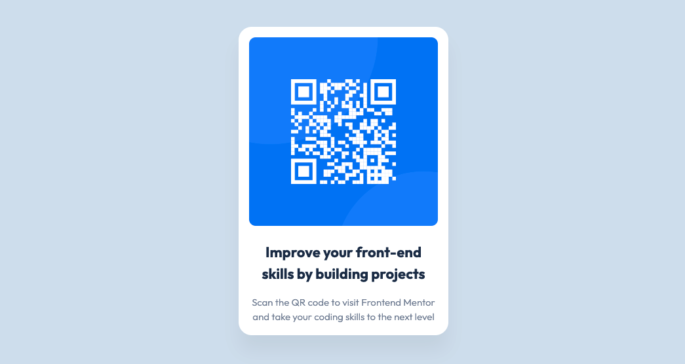

# FrontendMentor Challenge | QR Code Component

This is a challenge from FrontendMentor.   
You can find the description of the task here:  
https://www.frontendmentor.io/challenges/qr-code-component-iux_sIO_H



My goal in this challenge was to:
- use gulp as task-runner
- develop the component as fast as possible
- make an accurate estimation for this component

### How to run
```bash
git clone https://github.com/jeromehaas/qr-code-component-fm.git
cd qr-code-component-fm
nvm use
npm install 
npm start
```